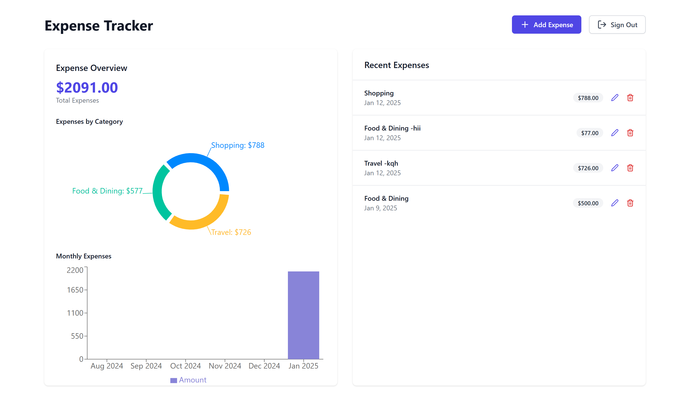
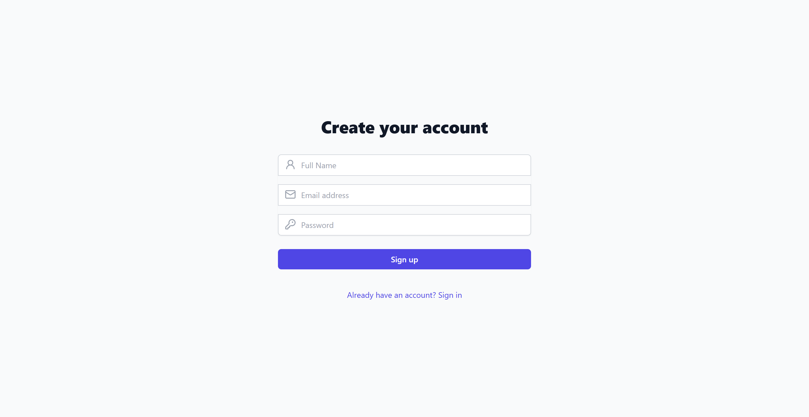
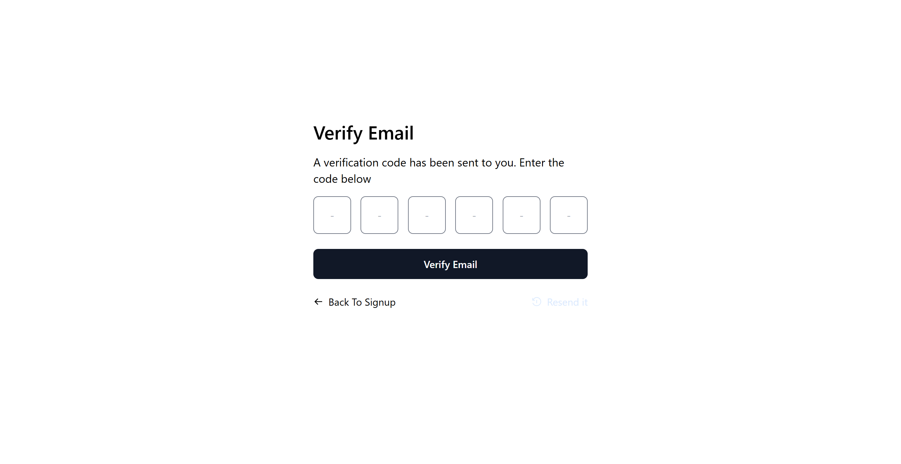
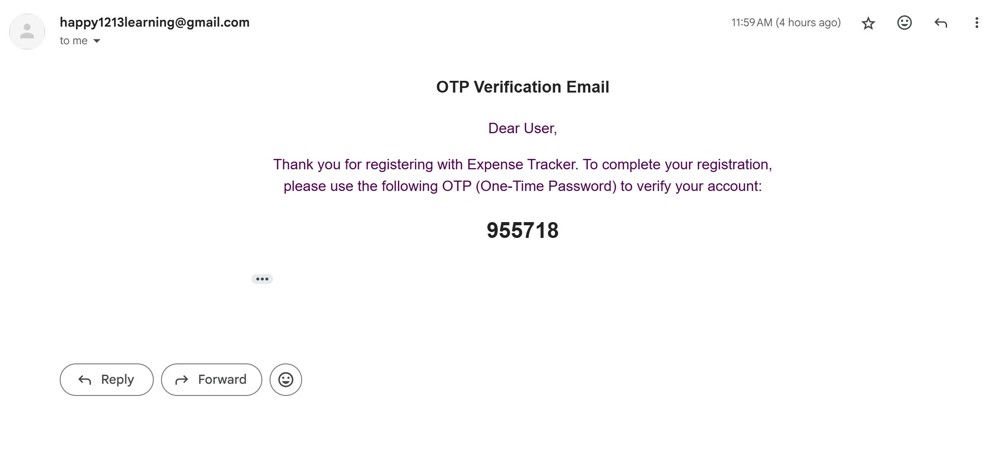
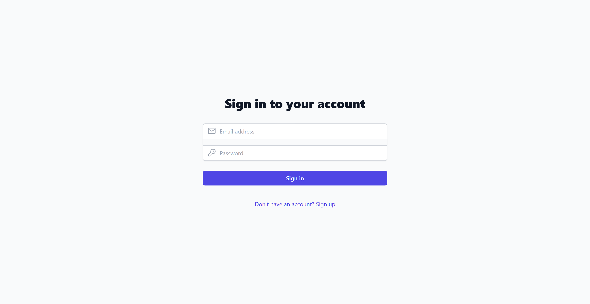

# Expense Tracker [Visit website](https://expense-tracker-kappa-neon.vercel.app/)

## Overview

Expense Tracker is a **web application** designed to help users **manage and track their personal expenses**. This intuitive app allows users to add, edit, delete, and view expenses with ease, giving them a comprehensive understanding of their spending habits. Built using **React**, **TailwindCSS**,**ReduxJs**,**NodeJs**,**MongoDB**,**ExpressJs** and other modern technologies, it provides a seamless and responsive experience for budgeting.


With features like **authentication and authorization**,**expense categorization**, **detailed expense reports**, and **visual charts**, this app is ideal for anyone who wants to stay on top of their finances.

---

## Features

### 📊 **Track Expenses**
- Add, edit, and delete expenses effortlessly.
- View detailed information for each expense including **amount**, **category**, **description**, and **date**.

### 📅 **Expense Dashboard**
- See a summary of your total expenses and manage your budget more effectively.
- View expenses broken down by category to understand where your money is going.

### 📝 **Expense Categories**
- Organize expenses into categories like **Food & Dining**, **Shopping**, **Transportation**, and more.
- Customizable categories to fit your needs.

### ⚙️ **Responsive UI**
- Built with **React** and **TailwindCSS**, making it **responsive** and **mobile-friendly**.
- User-friendly interface designed to make expense tracking a smooth experience.

### 🔒 **Authentication & Authorization**

Our app includes a fully functional **authentication and authorization** system using **access tokens** and **refresh tokens** to ensure secure login, persistent sessions, and role-based access control.

#### **Key Features of Authentication:**
- **User Registration:** Users can sign up with their basic information (name, email, and password).

- **Email Verification:** An OTP (One-Time Password) is sent to the user's email for verification. The user must enter this OTP to activate their account.


- **Login:** Users can log in using their email and password. Upon successful login, an **access token** and a **refresh token** are issued to the user.
- **Token-Based Authentication:** The **access token** is used for making authenticated requests to the server, while the **refresh token** is used to obtain a new **access token** when the old one expires.
- **Persistent Sessions:** The **access token** is stored in memory or local storage (e.g., sessionStorage), and the **refresh token** is stored securely (preferably in HTTP-only cookies).
- **Role-Based Access Control (RBAC):** Access to certain routes and data is restricted based on user roles (e.g., admin, user).

#### **How It Works:**

1. **Sign Up:**
   - The user registers by providing their **name**, **email**, and **password**.
   - After registration, an **OTP** is sent to the user's email for verification. The user must input the OTP to confirm their email.
   - Upon successful verification, the user’s account is created and they can proceed to log in.

2. **Login:**
   - The user logs in by entering their **email** and **password**.
   - On successful login, the backend issues two tokens:
     - **Access Token:** This token is used for making authenticated requests to the API.
     - **Refresh Token:** This token is used to obtain a new **access token** when the original one expires.
   - **Access Token** is stored in **localStorage** or **sessionStorage** in the browser (for front-end applications), and the **Refresh Token** is stored in **HTTP-only cookies** for security.

3. **Token Storage:**
   - **Access Token:** This token typically has a short expiration time (e.g., 15 minutes to 1 hour). It is stored in **localStorage** or **sessionStorage** on the client-side and is sent with each request to authenticate API calls.
   - **Refresh Token:** This token is more persistent and is stored in **HTTP-only cookies**. It is used to obtain a new **access token** after it expires. HTTP-only cookies help mitigate risks of cross-site scripting (XSS) attacks.

4. **Token Expiration & Refresh Flow:**
   - **Access Token Expiry:** When the **access token** expires, the client sends the **refresh token** to the server to obtain a new **access token**.
   - **Refresh Token Expiry:** Refresh tokens are long-lived but also have an expiration time (e.g., 30 days). If the **refresh token** expires, the user needs to log in again.
   - **Refresh Token Flow:**
     - The client sends the expired **access token** along with the **refresh token** to the backend.
     - The backend validates the **refresh token** and issues a new **access token**.
     - The **new access token** is returned to the client for future requests.

5. **Authorization:**
   - The backend validates the **access token** before allowing access to protected routes.
   - **Role-based access control (RBAC)** is used to restrict access to certain pages or resources based on the user's role (e.g., admin or user).
   - **Admin-only routes** will be accessible only to users with an **admin** role, while regular users will only have access to their own data.

6. **Logout:**
   - To log out, the client deletes both the **access token** (from **localStorage** or **sessionStorage**) and the **refresh token** (from **HTTP-only cookies**).
   - After logout, the user is redirected to the login page.

#### **Flow of Authentication:**
1. **Sign Up:**
   - User submits their details and receives an OTP via email.
   - User inputs the OTP and successfully verifies their account.

2. **Login:**
   - User submits login credentials (email and password).
   - Backend issues both an **access token** and **refresh token**.
   - **Access token** is stored in **localStorage** or **sessionStorage** for use in subsequent requests.
   - **Refresh token** is stored in **HTTP-only cookies** for secure token refresh.

3. **Access Token Expiry and Refresh:**
   - The client periodically checks for **access token** expiry.
   - Upon expiration, the client sends the **refresh token** to the backend to request a new **access token**.
   - If successful, the backend returns a new **access token**, which the client stores for further requests.

4. **Authorization Flow:**
   - When the user attempts to access restricted resources or routes, the server verifies the **access token**.
   - Based on the role (admin or user), the server grants or denies access to specific resources.

5. **Logout:**
   - Client deletes the **access token** and **refresh token**.
   - The session is terminated and the user is redirected to the login page.

#### **Benefits of Access & Refresh Tokens System:**
- **Secure Authentication:** The **access token** ensures secure authentication for each request, while the **refresh token** allows users to maintain their session without re-authenticating frequently.
- **Persistent Sessions:** The **refresh token** allows users to stay logged in even after the **access token** expires, improving user experience.
- **Improved Security:** Storing **access tokens** in **localStorage** (or **sessionStorage**) and **refresh tokens** in **HTTP-only cookies** prevents exposure to XSS attacks and ensures secure handling of sensitive data.
- **Role-Based Access Control:** Different user roles can be configured, ensuring that sensitive data and actions are protected and only accessible by authorized users.

#### **Technologies Used for Authentication:**
- **JWT (JSON Web Tokens):** Used for secure token-based authentication.
- **Node.js/Express (Backend):** Handles user authentication requests, token generation, and validation.
- **bcryptjs:** Securely hashes passwords before storing them.
- **localStorage/sessionStorage:** Stores **access tokens** to maintain the user's session.
- **HTTP-only Cookies:** Used to securely store **refresh tokens** to prevent access from JavaScript.
- **Axios (Frontend):** Sends requests to the backend for login, signup, and token refresh.

---

By utilizing **access tokens** and **refresh tokens**, this authentication system provides a secure, scalable, and persistent way to manage user sessions, improve performance, and ensure that sensitive data remains protected. This flow also supports long-lasting user sessions with minimal reauthentication required, enhancing the overall user experience.

---

## Technologies Used

The Expense Tracker app is built using a variety of modern technologies to provide a seamless, secure, and efficient user experience. Here's a list of the key technologies used:

### **Frontend:**
- **React**: A powerful JavaScript library for building user interfaces, enabling efficient rendering and component-based architecture.
- **React Hooks**: Used to manage state and lifecycle in functional components. Key hooks used include `useState` for state management and `useEffect` for side effects.
- **TailwindCSS**: A utility-first CSS framework for fast styling and responsive design. TailwindCSS helps to create a clean and modern user interface with minimal effort.
- **Lucide Icons**: A set of open-source icons used for various actions like editing and deleting expenses, providing a visually appealing interface.
- **DayJS**: A lightweight JavaScript library used for formatting and handling dates. DayJS is used to display formatted dates on the app in a consistent way.
- **ReduxJS**: A state management library for React that helps manage and centralize the app’s state, ensuring consistent data flow throughout the application. Redux is used for handling global app state like user authentication and expenses.
- **Axios**: A promise-based HTTP client for making requests to the backend API, handling GET, POST, PUT, and DELETE operations for expenses and authentication.

### **Backend:**
- **Node.js**: A JavaScript runtime built on Chrome’s V8 engine that is used to build the backend of the application, providing a scalable and fast environment for handling API requests.
- **Express.js**: A minimalist web framework for Node.js that helps manage routing, middlewares, and requests in a simple and efficient manner. It provides routes for user authentication, expense management, and token handling.
- **MongoDB**: A NoSQL database used to store user data, expenses, and authentication-related information. MongoDB’s flexible schema structure allows for dynamic and scalable data storage.
- **Mongoose**: A MongoDB object modeling tool designed to work in an asynchronous environment, used for defining models and interacting with MongoDB in a more structured way.
- **JWT (JSON Web Tokens)**: A compact and self-contained way for securely transmitting information between the frontend and backend as a JSON object. It is used to implement token-based authentication for login and API security.
- **Nodemailer**: A module used for sending emails from the backend. It is used for email verification (OTP) when a user signs up, ensuring secure and verified registrations.

### **Authentication & Authorization:**
- **Access Tokens & Refresh Tokens**: Secure authentication using JWTs. Access tokens are used for user authentication and expire after a short period. Refresh tokens are used to obtain new access tokens without requiring the user to log in again.
- **Role-Based Access Control (RBAC)**: Authorization system that ensures different user roles (e.g., user, admin) have access to different resources in the application. For example, admins can manage user data and view analytics.

### **Other Tools & Libraries:**
- **Cors**: A Node.js package used to enable Cross-Origin Resource Sharing (CORS), allowing the backend to handle requests from different domains.
- **dotenv**: A zero-dependency module that loads environment variables from a `.env` file into `process.env` in Node.js, used for storing sensitive data like API keys and database credentials.
- **Bcrypt.js**: A library to hash passwords securely before storing them in the database, ensuring user passwords are encrypted.

By using this powerful tech stack, the app offers a fast, secure, and seamless experience for users to manage their expenses, while also ensuring a scalable backend and strong authentication and authorization mechanisms.

---

### Clone the repository

To clone the repository, run the following commands in your terminal:

```bash
git clone https://github.com/shashank2314/Expense-Tracker

